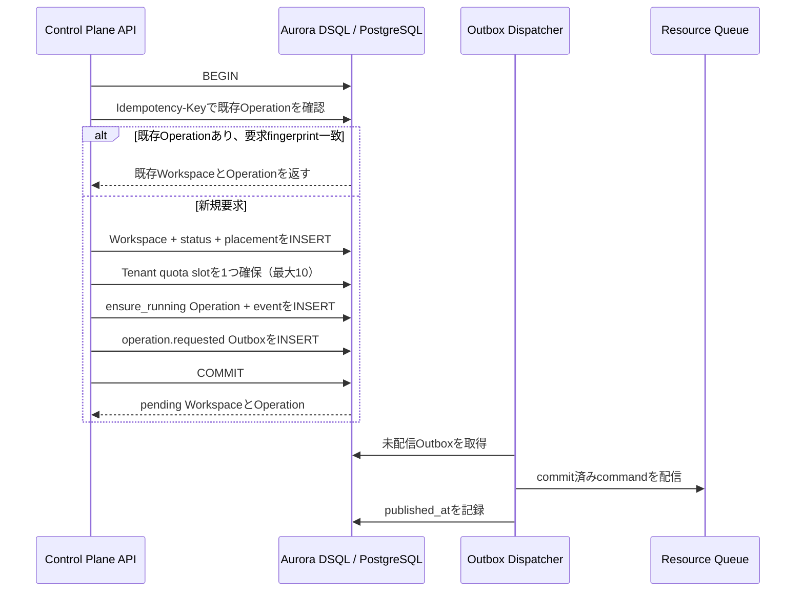

# Workspace作成フロー

## トランザクションの内容

`workspaces.Create`はWorkspaceの作成要求を、次のレコード一式として一つのDB transactionに保存します。

- `workspaces`: 論理Workspace。IDはMicroVM IDと独立したUUIDv4ベースの値。
- `workspace_status`: `desired_state=running`、`observed_state=pending`。
- `placements`: 呼び出し元が選んだResource Plane。
- `resource_plane_reservations`: 選択先のWorkspace枠を記録し、設定済みCapacity counterを作成時に予約する。
- `operations`: `ensure_running`を`pending`で作成し、冪等キーと要求fingerprintを保存。
- `operation_events`: 初期状態の`operation.created`イベント。
- `outbox_events`: Resource Planeへ配信する`operation.requested` command。
- `workspace_quota_slots`: Tenantあたり10個の固定slotから1つを確保し、同時作成でも上限を超えないようにする。

Outbox DispatcherはAPI transaction外でcommit済みcommandをSQSへ配送します。at-least-once配送、lease、retryの仕様は[Outbox Dispatcher](outbox-dispatcher.md)を参照してください。API transactionからSQSへ直接送信しません。

## HTTP APIとPlacement設定

`POST /v1/tenants/{tenant_id}/workspaces`はTenant memberを認証し、Hako UserをOwnerとして作成します。Bodyは`{"name":"api-dev"}`、`Idempotency-Key` headerは必須です。Resource Plane ID、Runtime Class、Imageはクライアントから受け取らず、API server設定から補います。成功時は非同期受付として`202 Accepted`とWorkspace、pending Operationを返します。Tenant quota超過は`409 workspace_quota_exceeded`です。

SchedulerはControl Plane DBの`resource_plane_status=active`、Resource Plane capability、health状態、server-side region制約、Tenant placement policyから候補を絞り、設定されたTenant cost ceiling/isolation floorを適用します。その後、health順位（cost ceiling指定時はcost tierも優先）とObserved Stateが`deleted`ではないWorkspace数でResource Planeを選びます。Capacity設定があるPlaneは枠を同じtransaction内で予約し、上限到達時には次の候補を試します。API serverには`HAKO_DEFAULT_WORKSPACE_IMAGE`を設定し、必要なら`HAKO_DEFAULT_RESOURCE_PLANE_REGION`でregionを制約します。Runtime Classは`HAKO_DEFAULT_WORKSPACE_RUNTIME_CLASS`で指定でき、省略時は`standard`です。Tenant policyはOwner/Adminが管理し、制約の意味は[Tenant Placement Policy](tenant-placement-policy.md)、Capacity予約は[Resource Plane Capacity](resource-plane-capacity.md)、health状態と更新方法は[Resource Plane Health](resource-plane-health.md)を参照してください。

## 冪等性と競合

1. Idempotency keyはTenant内で一意です。同じ要求のHTTP retryでは同じkeyを使います。
2. 要求fingerprintにはOwner IDと正規化済みのWorkspace name、runtime class、imageを含めます。サーバー生成ID、時刻、Scheduler内部のPlacement判断は含めません。別ユーザーが同じTenant内で同じkeyを誤用しても既存Workspaceを再利用しません。
3. 同じkey・同じfingerprintなら既存のWorkspace/Operationを返します。同じkeyでfingerprintが異なる場合は`operations.ErrIdempotencyConflict`を返し、API層でHTTP 409相当へ変換します。
4. 同一keyの要求が同時に開始した場合、unique keyとDSQL OCCが一方を勝者にします。敗者のWorkspace/status/placement insertはtransaction rollbackされ、勝者のcommit後に新しいtransactionで既存Operationを読み直します。
5. OCC retryでは同じ生成IDとtimestampを再利用します。callbackにはDB操作だけがあり、SQS送信やAWS API呼び出しはありません。

Store層ではPlacement選択をcreate transaction内で行います。Client request fingerprintにPlacement判断は含めないため、同じ作成要求のretryは既存Operationを返し、再配置しません。

## Outbox command

Outbox payloadはversion付きJSONです。現在のschema versionは`1`で、`operation_id`、`tenant_id`、`workspace_id`、`resource_plane_id`、`type`、`created_at`を含みます。Queue配送はOutbox Dispatcherがat-least-onceで行います。Resource Controller側の重複排除はOperation ID/event IDで行う必要があり、Controllerは後続タスクです。
